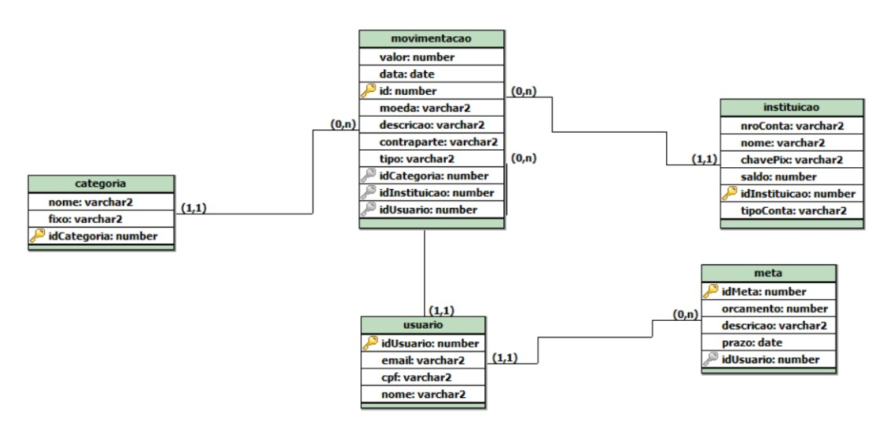
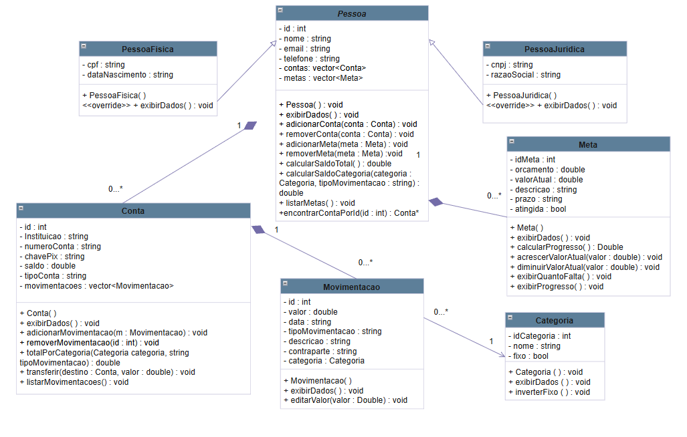
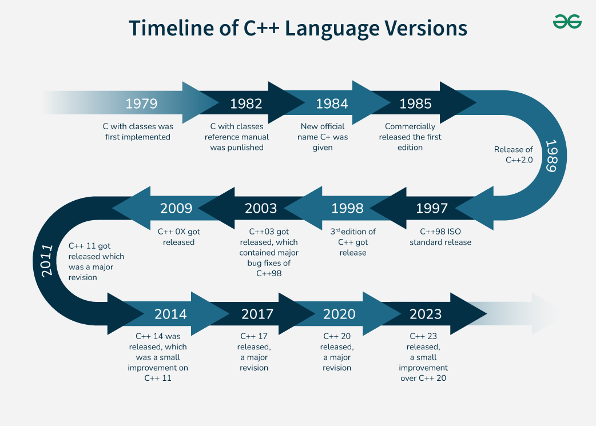

# financeControl

## 1. Visão geral do software

O **financeControl** é um sistema de controle financeiro desenvolvido em C++ para organizar pessoas, contas, movimentações, categorias e metas. O objetivo do trabalho é permitir o cadastro e o acompanhamento de informações financeiras de forma simples, usando conceitos de Programação Orientada a Objetos.

### Problema que o software resolve

Muitas pessoas e empresas precisam registrar entradas, saédas, contas, categorias e objetivos financeiros em um único lugar. Este projeto resolve esse problema ao centralizar esses dados e permitir consultas como:

- cadastro de pessoas físicas e jurídicas;
- criação e gerenciamento de contas;
- registro de movimentações financeiras;
- organização por categorias;
- acompanhamento de metas financeiras;
- consulta de saldo total e saldo por categoria.



### Principais funcionalidades

- criar, listar e selecionar pessoas;
- diferenciar pessoa física e pessoa jurídica;
- adicionar e remover contas;
- adicionar, listar e remover movimentações;
- cadastrar categorias padrão e novas categorias;
- criar metas e acompanhar progresso;
- calcular saldo total e saldo por categoria;
- transferir valores entre contas.

## 2. Diagrama das classes



### Leitura do diagrama

- `Pessoa` é a classe base abstrata.
- `PessoaFisica` e `PessoaJuridica` herdam de `Pessoa`.
- `Pessoa` possui várias `Conta` e várias `Meta`.
- `Conta` possui várias `Movimentacao`.
- `Movimentacao` referencia uma `Categoria`.
- `Conta` e `Pessoa` usam `Categoria` para consultas de saldo e classificação.

## 3. Breve descricao sobre a linguagem escolhida

# O que é o C++?

- Eficiência e  Baixo e Alto Nível
- Desenvolvido por Bjarne Stroustrup em 1979
- C with Classes
- Renomeada para C++ em 1983



# Principais aplicações:

- Engine de jogos;
- Sistemas operacionais;
- Sistemas embarcados;
- Navegadores da web;
- Aplicações da Blockchain;
- IoT;
- Entre outros;

# Principais características:

- Incremento;
- Alta performance;
- Gerenciamento de memória de baixo nível;

# Vantagens:

- Grande desempenho;
- Bastante utilizada no mercado;
- Suporta Orientação a Objetos;
- Grande diversidade de bibliotecas;
- Compatível com C;

# Desvantagens:

- Curva de aprendizado maior;
- Gerenciamento de memória em baixo nível;

## 4. Implementações realizadas na linguagem

### 4.1 Classe abstrata Pessoa

A classe `Pessoa` centraliza os dados comuns entre pessoas físicas e jurídicas, como nome, email, telefone, contas e metas. Ela também define o método abstrato `exibirDados()`, obrigando as classes filhas a implementarem sua própria exibição.

```cpp
virtual void exibirDados() const = 0;
```

Isso garante polimorfismo e separa o que é comum do que é específico de cada tipo de pessoa.

### 4.2 Herança em PessoaFisica e PessoaJuridica

As classes filhas reaproveitam a estrutura da classe base e adicionam seus campos específicos.

```cpp
class PessoaFisica : public Pessoa {
```

```cpp
class PessoaJuridica : public Pessoa {
```

Assim, o sistema evita repetiçã de código e torna a manutenção mais simples.

### 4.3 Controle de contas e movimentações

A classe `Conta` armazena informações bancárias e uma lista de movimentações. O sistema permite adicionar, listar e remover movimentações, além de realizar transferência entre contas.

```cpp
void adicionarMovimentacao(const Movimentacao& m);
void removerMovimentacao(int id);
void transferir(Conta& destino, double valor);
```

### 4.4 Classificação por categoria

Cada movimentação recebe uma `Categoria`, o que permite organizar entradas e saídas e calcular totais por categoria.

```cpp
double totalPorCategoria(const Categoria& categoria, const std::string& tipoMovimentacao) const;
```

### 4.5 Metas financeiras

A classe `Meta` representa um objetivo financeiro com orçamento, prazo, descrição e progresso. Ela permite acompanhar quanto já foi acumulado e quanto ainda falta.

```cpp
double calcularProgresso() const;
void exibirProgresso() const;
void exibirQuantoFalta() const;
```

## 5. Exemplos de trechos relevantes do código

### Exemplo 1: criação de uma pessoa física

```cpp
pessoasFisicas.push_back(PessoaFisica(id, nome, email, telefone, cpf, dataNascimento));
```

### Exemplo 2: criação de uma conta

```cpp
p.adicionarConta(Conta(id, instituicao, numeroConta, chavePix, saldo, tipoConta));
```

### Exemplo 3: criação de uma movimentação com categoria

```cpp
conta->adicionarMovimentacao(Movimentacao(
	id,
	valor,
	data,
	tipoMovimentacao,
	descricao,
	contraparte,
	categorias[categoriaIdx - 1]
));
```

### Exemplo 4: criação de uma meta

```cpp
pf.adicionarMeta(Meta(id, orcamento, prazo, descricao, valorAtual));
```

## 6. Demonstração da execução

O programa possui um menu em modo texto. A execução começa na classe principal do arquivo `Main2.cpp`, onde são exibidas as opções para:

- criar pessoa física;
- criar pessoa jurídica;
- listar pessoas;
- selecionar uma pessoa;
- gerenciar categorias;
- sair do sistema.

Ao selecionar uma pessoa, é possível acessar novos menus para:

- exibir dados;
- gerenciar contas;
- adicionar e listar metas;
- remover metas;
- cadastrar e listar movimentações;
- consultar saldo total e saldo por categoria.

### Saída esperada na inicialização

```text
Controle Financeiro
1 - Criar Pessoa Fisica
2 - Criar Pessoa Juridica
3 - Listar Pessoas
4 - Selecionar Pessoa
5 - Gerenciar Categorias
6 - Sair
```

### Observação importante da execução

No menu principal, a opção de saída í `6`.

## 7. Como compilar

Os comandos abaixo já estão validados no projeto.

### Compilação

```bash
g++ Main.cpp Categoria/Categoria.cpp Conta/Conta.cpp Movimentacao/Movimentacao.cpp Meta/Meta.cpp Pessoa/Pessoa.cpp PessoaFisica/PessoaFisica.cpp PessoaJuridica/PessoaJuridica.cpp -o financeControl.exe
```

### Execução

```bash
./financeControl.exe
```